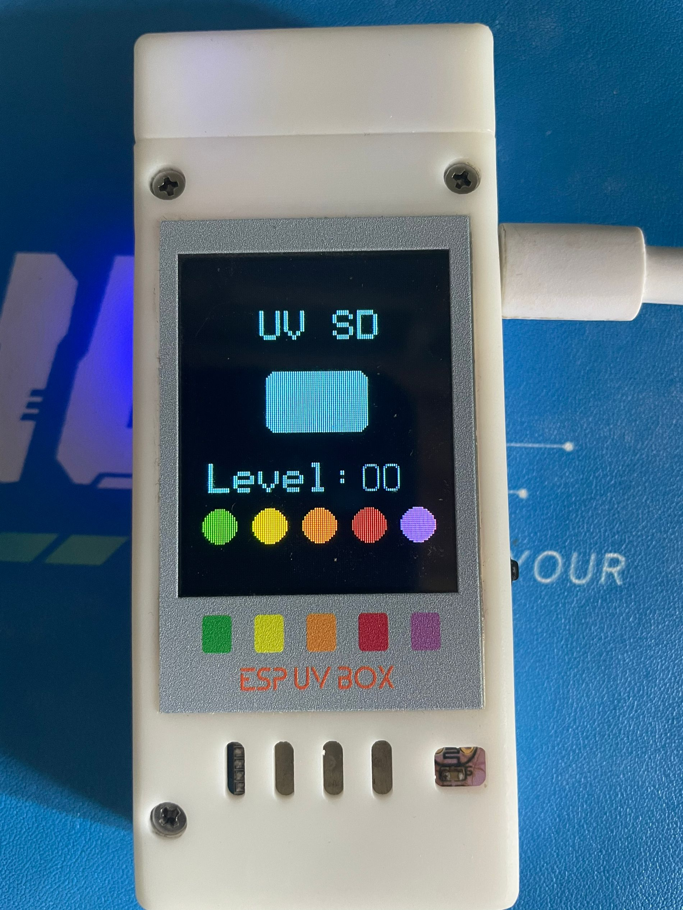
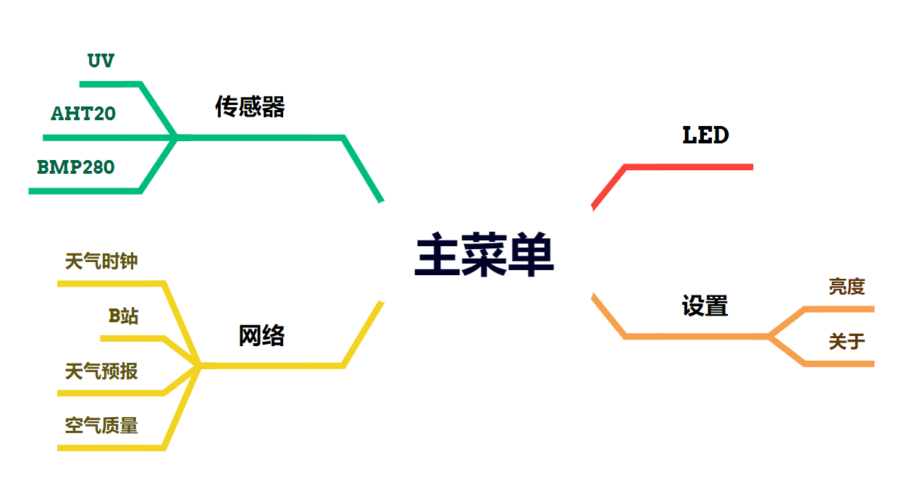
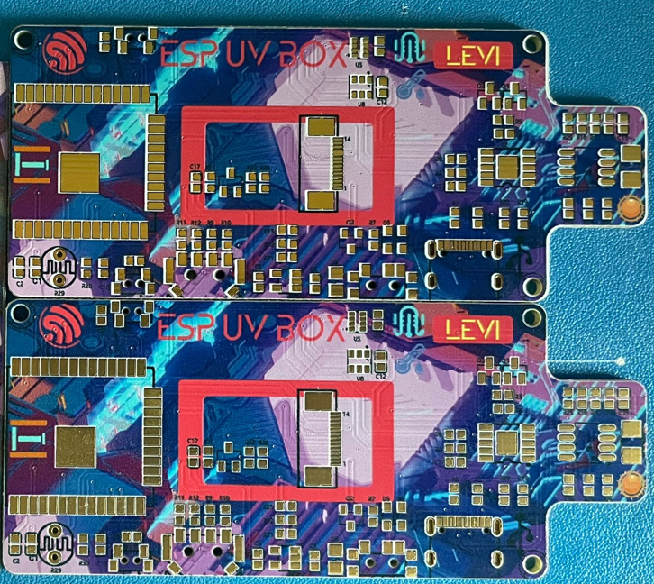
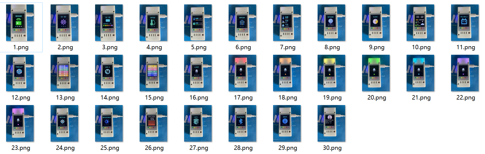
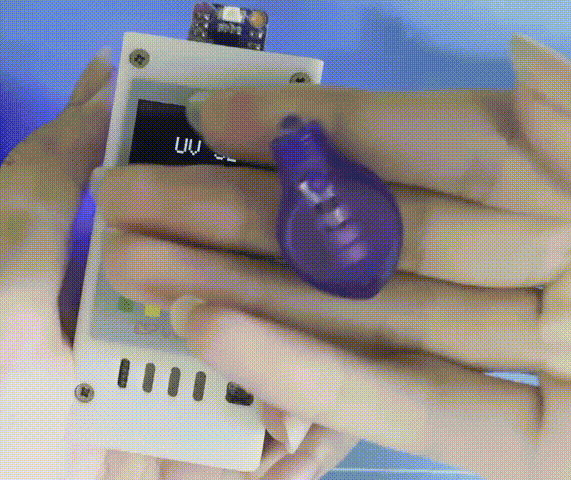

# ESP32 UV BOX

ESP32 UV BOX 
基于ESP-WROOM-32D-N8的简易紫外线等级检测盒

板载S12SD紫外线传感器，AHT20温湿度传感器，BMP280气压传感器，WS2812灯珠，1.8寸TFT

<p align="center"></p>

[![Contributors][contributors-shield]][contributors-url]
[![Forks][forks-shield]][forks-url]
[![Stargazers][stars-shield]][stars-url]
[![Issues][issues-shield]][issues-url]
[![MIT License][license-shield]][license-url]

<br />

<p align="center">
  <a href="https://github.com/levi52/ESP32_UV_BOX/">
    
  </a>

  <h3 align="center">ESP32 UV BOX</h3>
  <p align="center">
    <br />
    <a href="https://github.com/levi52/ESP32_UV_BOX/blob/main/README.md"><strong>探索文档 »</strong></a>
    <br />
    <br />
    <a href="https://github.com/levi52/ESP32_UV_BOX">查看代码</a>
    ·
    <a href="https://github.com/levi52/ESP32_UV_BOX/issues">报告Bug</a>
    ·
    <a href="https://github.com/levi52/ESP32_UV_BOX/issues">提出新特性</a>
  </p>
</p>

# 目录

- [文件目录说明](#文件目录说明)
- [开发工具](#开发工具)
- [硬件](#硬件)
- [软件](#软件)
    - [使用到的库](#使用到的库)
    - [程序简述](#程序简述)
      - [屏幕页面](#屏幕页面)
      - [UV](#uv)
      - [AHT20](#aht20)
      - [BMP280](#BMP280)
      - [网络配置](#网络配置)
      - [网络天气](#网络天气)
      - [网络时间](#网络时间)
      - [哔哩哔哩](#哔哩哔哩)
      - [按键控制](#按键控制)
- [版本控制](#版本控制)
- [作者](#作者)
- [鸣谢](#鸣谢)
- [END](#END)

# 文件目录说明
```
ESP32_UV_BOX
│  clearBuildDir.bat   build文件删除
│  default_8MB.csv     存储分区
│  LICENSE             开源协议
│  platformio.ini      开发配置
│  README.md           说明文档
├─assets/              静态文件
├─include
│      README
├─lib                  外部库
│  │  README
│  └─ArduinoZlib 
├─src                  主要文件
│  │  button.cpp       按键控制
│  │  button.h
│  │  main.cpp         主程序
│  │  network.cpp      网络请求
│  │  network.h
│  │  sensor.cpp       传感器
│  │  sensor.h
│  │  ui.cpp           界面
│  │  ui.h
│  ├─font/             字体文件
│  └─img/              图片文件
└─test/                测试文件

```

# 开发工具
+ [立创EDA(专业版)](https://pro.lceda.cn/editor) - 硬件设计
+ [Solidworks 2023]() - 3D外壳设计
+ [Visual Studio Code](https://code.visualstudio.com/) + [PlatformIO](https://platformio.org/) - 代码编写
+ [RGB Color Picker](https://rgbcolorpicker.com/565) - 取色
+ [File to C style array converter](https://notisrac.github.io/FileToCArray/) - 图片转换
+ [iconfont-阿里巴巴矢量图标库](https://www.iconfont.cn/) - 图标字体

# 硬件

硬件设计见[立创开源硬件平台](https://oshwhub.com/levi_01/simple-esp-uv-detection-box)

# 软件

## 使用到的库

- [TFT_eSPI](https://github.com/Bodmer/TFT_eSPI) - 屏幕驱动
- [AHT20](https://github.com/sparkfun/SparkFun_Qwiic_Humidity_AHT20_Arduino_Library) - AHT20驱动
- [Grove - Barometer Sensor BMP280](https://github.com/Seeed-Studio/Grove_BMP280) - BMP280驱动
- [OneButton](https://github.com/mathertel/OneButton) - 按键控制
- [FastLED](https://github.com/FastLED/FastLED) - WS2812驱动
- [NTPClient](https://github.com/arduino-libraries/NTPClient) - 网络时间
- [ArduinoJson](https://arduinojson.org/) - 数据解析
- [ArduinoZlib](https://github.com/tignioj/ArduinoZlib) - 文件解压缩

## 程序简述

## 屏幕页面

屏幕尺寸为1.8寸，分辨率是128x160，屏幕驱动是ST7735，使用[TFT_eSPI](https://github.com/Bodmer/TFT_eSPI)库驱动屏幕，所有界面使用`TFT_eSPI`绘制

使用`TFT_eSPI`需要修改配置文件`User_Setup.h`，根据屏幕类型和显示情况修改内容
```cpp
#define ST7735_DRIVER // 屏幕驱动
#define TFT_RGB_ORDER TFT_RGB // 颜色顺序
#define TFT_WIDTH  128  // 屏幕宽度
#define TFT_HEIGHT 160  // 屏幕高度
#define ST7735_GREENTAB2  // 仅ST7735
// #define TFT_INVERSION_ON // 黑白反转
// #define TFT_INVERSION_OFF
#define TFT_BL   17 // 背光引脚
#define TFT_MOSI 23
#define TFT_SCLK 18
#define TFT_CS   5  // Chip select control pin
#define TFT_DC    2  // Data Command control pin
#define TFT_RST   4  // Reset pin (could connect to RST pin)
//#define TFT_RST  -1  // Set TFT_RST to -1 if display RESET is connected to ESP32 board RST
```

根据以下结构设计绘制界面：

> 页面结构设计参考：[OSHWHub: 黑人黑科技](https://oshwhub.com/bukaiyuan/works)的开源工程[ESP32 万能遥控器](https://oshwhub.com/bukaiyuan/ESP32-hang-mu-yao-kong-qi)

使用`ledc`控制引脚输出PWM调节屏幕背光亮度

## UV
使用S12SD传感器来检测紫外线，然后经过放大，使用ADC采集电压，根据电压范围判断紫外线指数等级

程序中使用此函数获取紫外线指数
```cpp
uint8_t sensor_uv_data(void)
```

## AHT20
使用AHT20传感器来检测环境温度和湿度，使用IIC通信协议

程序中使用此函数来获取温湿度数据
```cpp
AHT20Data sensor_aht20_data(void);
```
`AHT20Data`为定义的结构体数据
```cpp
struct AHT20Data
{
    float temperature;
    float humidity;
};
```
## BMP280
使用BMP280传感器来检测环境压强和温度，并能够计算得到海拔高度，使用IIC通信协议

程序中使用此函数来获取压强等数据
```cpp
BMP280Data sensor_bmp280_data(void);
```
`BMP280Data`为定义的结构体数据
```cpp
struct BMP280Data
{
    float temperature;
    float pressure;
    float altitude;
};
```

## 网络配置

初次使用时，会建立网络`ESP_UV_BOX_WIFI`

连接网络，浏览器打开网址`192.168.1.1`，会出现配网页面
> 页面代码参考: [CSDN: 请收藏！分享一个ESP32/ESP8266高颜值WIFI配网页面代码-带下拉选择框和中英文版本。文末有arduino配网代码。](https://blog.csdn.net/YANGJIERUN/article/details/129092371)

一共五个输入框，分别是`WIFI SSID`, `WIFI PASSWORD`, `Private KEY`, `Location ID`，`bilibili UID`

网络配置相关函数如下
```cpp
bool wifi_scan(void);
void wifi_connect(int timeOut_s);
void wifi_disconnect(void);
void ap_init(void);
void server_init(void);
void handleRoot(void);
void handleConfigWifi(void);
void handleNotFound(void);
void doClient(void);
void wifiConfigBySoftAP(void);
```

## 网络天气

天气等数据使用[和风天气](https://dev.qweather.com/)的[API](https://dev.qweather.com/docs/api/)，免费订阅每日有1000次请求

> [订阅规则](https://dev.qweather.com/docs/finance/subscription/#comparison)

> 具体代码参考[B站：大聪明的二手脑袋](https://space.bilibili.com/393773788)的视频[Dudu天气时钟版本更新，全面对接和风天气，2.0版本继续开源](https://www.bilibili.com/video/BV1wj421Z7Ds)

网络天气相关函数如下
```cpp
void get_weather_now(void);
void get_weather_future(void);
void get_air(void);
void get_city_id(void);
String urlEncode(const String& text);
```

## 网络时间

时间数据使用[NTPClient](https://github.com/arduino-libraries/NTPClient)库获取网络时间

网络相关函数如下
```cpp
void time_init(void);
void get_time(void);
```

## 哔哩哔哩

通过如下API接口获得JSON格式的数据，使用[ArduinoJson](https://arduinojson.org/)库解析获得关注数和粉丝数
```cpp
https://api.bilibili.com/x/relation/stat?vmid=用户UID
```
可以使用官网提供的[工具](https://arduinojson.org/v7/assistant/#/step1)生成解析代码

```json
{
    "code": 0,
    "message": "0",
    "ttl": 1,
    "data": {
        "mid": 378576508,
        "following": 318,
        "whisper": 0,
        "black": 0,
        "follower": 56
    }
}
```
生成的解析代码如下
```cpp
// String input;

JsonDocument doc;

DeserializationError error = deserializeJson(doc, input);

if (error) {
  Serial.print("deserializeJson() failed: ");
  Serial.println(error.c_str());
  return;
}

int code = doc["code"]; // 0
const char* message = doc["message"]; // "0"
int ttl = doc["ttl"]; // 1

JsonObject data = doc["data"];
long data_mid = data["mid"]; // 378576508
int data_following = data["following"]; // 318
int data_whisper = data["whisper"]; // 0
int data_black = data["black"]; // 0
int data_follower = data["follower"]; // 56
```

## 按键控制

使用拨轮开关作为控制输入，一共有三个按键，使用[OneButton](https://github.com/mathertel/OneButton)库，支持单击、双击、长按等操作。

# 实物
+ PCB
<p align="center"></p>

+ 页面
<p align="center"></p>

+ 紫外线检测
<p align="center"></p>

# 版本控制

该项目使用Git进行版本管理

# 作者

[levi52@github](https://github.com/levi52)

# 版权说明

该项目签署了MIT 授权许可，详情请参阅 [LICENSE](https://github.com/levi52/ESP32_UV_BOX/blob/main/LICENSE)

# 鸣谢

- [立创开源硬件平台](https://oshwhub.com/)
- [嘉立创](https://www.jlc.com/)
- [bilibili: 黑人黑科技](https://www.bilibili.com/video/BV19j41187SF)
- [bilibili: 大聪明的二手脑袋](https://www.bilibili.com/video/BV1wj421Z7Ds)
- [csdn: 杰森硬创客](https://blog.csdn.net/YANGJIERUN/article/details/129092371)

# END

<a href="https://git.io/typing-svg"></a>
<a href="https://github.com/levi52"></img></a> <a href="https://oshwhub.com/levi_01/works"></img></a> <a href="https://space.bilibili.com/378576508"></img></a> <a href="https://blog.csdn.net/Levi_5"></img></a> <a href="https://levi52.github.io/"></img></a>

<p align="center"><strong> <font color=#00bcd9 size=5>2024 levi5</font><strong></p>
<!-- <a href="https://git.io/typing-svg"></a> -->

<!-- links -->
[project-path]:levi52/ESP32_UV_BOX
[contributors-shield]: https://img.shields.io/github/contributors/levi52/ESP32_UV_BOX.svg?style=flat-square
[contributors-url]: https://github.com/levi52/ESP32_UV_BOX/graphs/contributors
[forks-shield]: https://img.shields.io/github/forks/levi52/ESP32_UV_BOX.svg?style=flat-square
[forks-url]: https://github.com/levi52/ESP32_UV_BOX/network/members
[stars-shield]: https://img.shields.io/github/stars/levi52/ESP32_UV_BOX.svg?style=flat-square
[stars-url]: https://github.com/levi52/ESP32_UV_BOX/stargazers
[issues-shield]: https://img.shields.io/github/issues/levi52/ESP32_UV_BOX.svg?style=flat-square
[issues-url]: https://img.shields.io/github/issues/levi52/ESP32_UV_BOX.svg
[license-shield]: https://img.shields.io/github/license/levi52/ESP32_UV_BOX.svg?style=flat-square
[license-url]: https://github.com/levi52/ESP32_UV_BOX/blob/main/LICENSE

